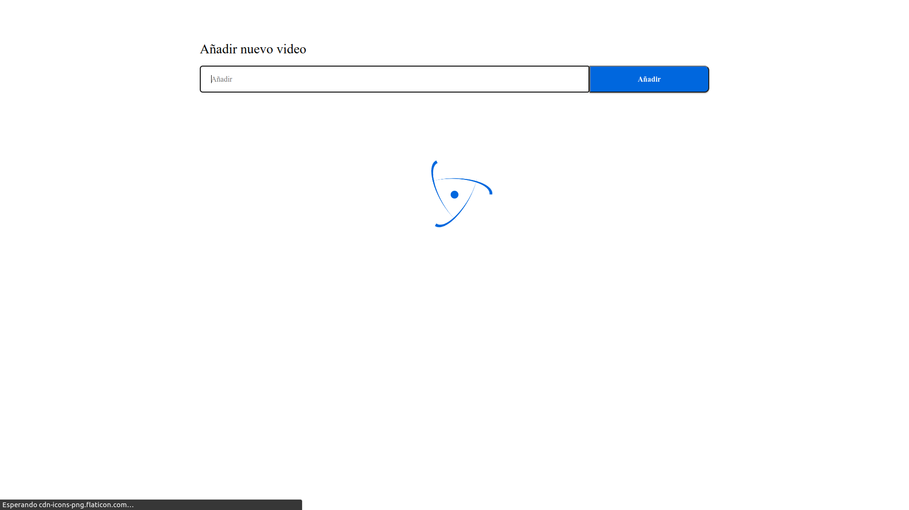
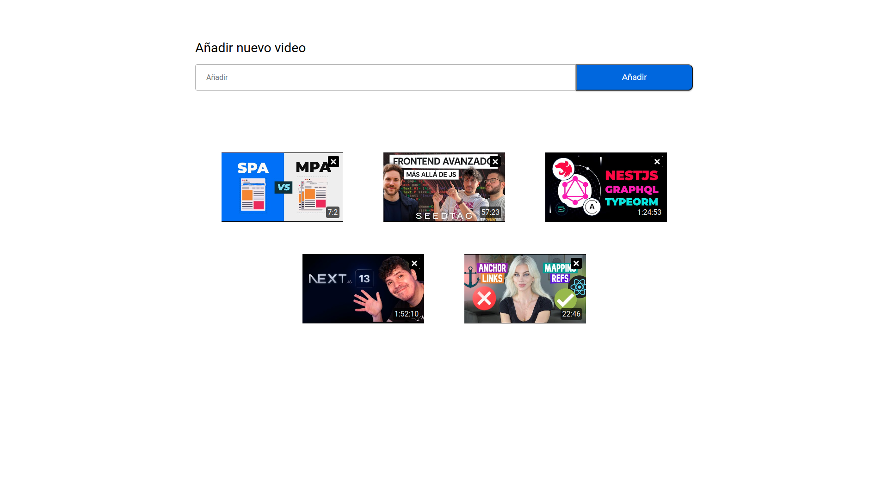
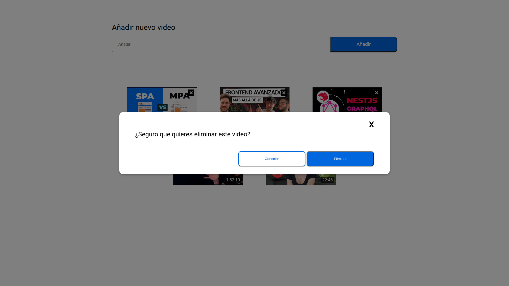
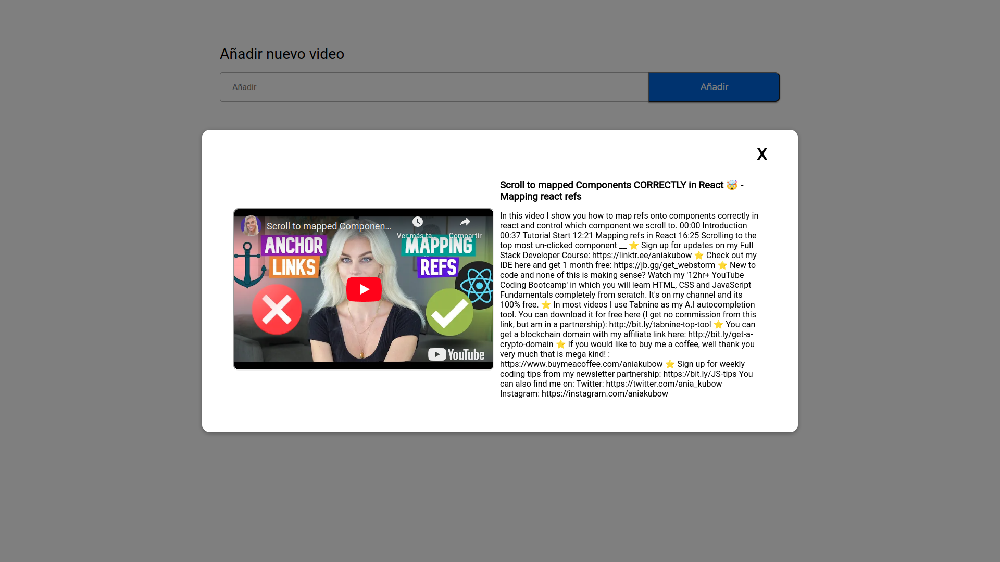
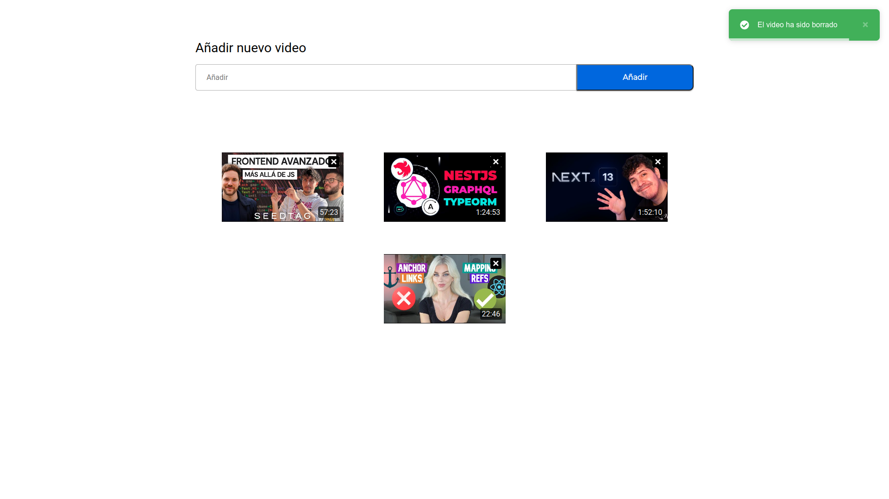

# YouTube Album AFEX

> Solución al test de Frontend enviado por la empresa AFEX en respuesta de mi solicitud al puesto para Frontend Developer Vue 3

## ENLACES

### Repositorio

> **_Github_**: https://github.com/pr0gr4mm3r-c0d3/youtube-album-afex

### Sitio Web

> **_Netlify_**: https://youtubealbum.netlify.app/

## SETUP PRINCIPAL

-   Vite
-   Vitest
-   Vue 3
-   Typescript
-   Pinia
-   Sass
-   Testing Library

## OTRAS HERRAMIENTAS USADAS

### APIS

-   YouTube
-   Firebase

### CONTROLADOR DE VERSIONES

-   Git / Github

### CI/CD

-   Github Actions

### HOSTING

-   Netlify

## CAPTURAS DE PANTALLAS

#### Cargando datos de firebase

#### Vista principal

#### Modal Eliminar

#### Modal Detalles de Video

#### Notificación de acción eliminar

